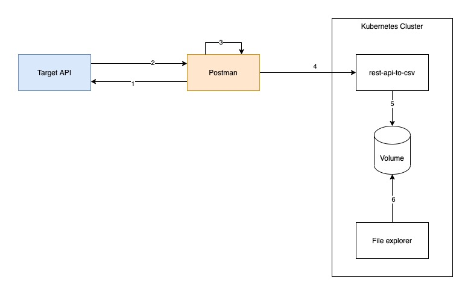

# Introduction
This tool stack is intended to analyze APIs and retrieve data in a batch. To make use of it, you need:
- an API you want to analyze
- an instance of the `rest-api-to-csv` running
- an instance of the `file explorer` running
- Postman



The process is as follows:
1) Postman makes a request to the target API
2) The API answers with JSON payload in the response
3) Postman processes the answer with the test script and creates a csv line (environment variables in Postman are used to persist data between different requests which are run sequentially in Postman Runner)
4) Postman sends the csv line to the `rest-api-to-csv` tool
5) The csv line is saved to the file mentioned in the payload
6) The resulting files can be accessed via `file explorer`

**not done yet:**
- an instance of the API scan tool: https://www.zaproxy.org/docs/docker/about/

# security & login
The below-created services don't have user & auth management or don't have it enabled. We are going to use basic Auth enabled via traefik in the overall infrastructure the tools are embedded in.

Required for this are two resources in Kubernetes:
- `sec-restapitool-ba` - secret with the user password combination
- `auth-restapitool` - a traefik middleware, apply in Portainer as "Advanced ApplicatioN"

```yaml
# # # # # # # # # # # # # # #
# Middleware BasicAuth
apiVersion: traefik.containo.us/v1alpha1
kind: Middleware
metadata:
  name: auth-restapitool
  namespace: ns-restapitool
spec:
  basicAuth:
    secret: sec-restapitool-ba
```

# rest-api-to-csv
Output data to CSV file. Based on https://blog.postman.com/write-to-your-local-file-system-using-a-postman-collection/

We are going to create a Docker container that is listening for input it should write to a file.

- interface will contain:
  - filename to write to
  - CSV line to write (Postman must create the whole line based on a test script you have to create)
- a folder is mounted into the container where all data is saved

Node dependnecies:
- [express](https://www.npmjs.com/package/express)
- `fs`
- `bodyParser`

Format for data transfer:

```json
{"records":
    [{
        "csvline":"field1;field2;",
        "filename":"filename-01.csv"
    },
    {
        "csvline":"field1;field2;field3",
        "filename":"filename-02.csv"
    }]
}
```

The whole [server script](server.js) is quite easy, so is the creation of the [Docker image](Dockerfile) which is done by a [Azure DevOps pipeline](azure-pipelines.yml). This image can then be run on any Docker or Kubernetes environment. When using a Kubernetes environment that is managed with Portainer, proceed as follows:

Configure namespace in Portainer:
- Name: ns-restapitool
- Hostname: csv.mydomain.com; filebrowser.mydomain.com
- Ingress with traefik must be enabled and configured
- Annotations:
```yaml
traefik.ingress.kubernetes.io/router.entrypoints: websecure
traefik.ingress.kubernetes.io/router.tls: true
traefik.ingress.kubernetes.io/router.tls.certresolver: myresolver
traefik.ingress.kubernetes.io/router.middlewares: ns-restapitool-auth-restapitool@kubernetescrd
```

Create a new instance of the `rest-api-to-csv` tool in Portainer:
- Name: rest-api-to-csv
- Image: jjscontainers.azurecr.io/rest-api-to-csv:1578
- Namespace: ns-restapitool
- Stack: restapitool
- Persisting data: path: /data; requested size: 20G; storage: azure file (must be a RWX = read-write-many storage class)
- Publishing the application: container port: 3000; hostname: csv.mydomain.com; route: /

# File explorer
Based on [file-explorer](https://github.com/adrientoub/file-explorer) (Docker Hub: [file-explorer](https://hub.docker.com/search?q=fileexplorer&type=image)).

Create a new instance of the tool in Portainer:
- Name: filebrowser
- Image: filebrowser/filebrowser:v2.16.0
- Namespace: ns-restapitool
- Stack: restapitool
- Environment variables: FB_NOAUTH: TRUE
- Persisting data: path: /srv; (same as volume used above)
- Publishing the application: container port: 80; hostname: filebrowser.mydomain.com; route: /

# Postman example

## Get data
You have to GET the information you need and write the result into environment variables. I'm using the following variables here:
- `SomeID` - Postman needs to know somehow which ID it must request at the source. Set an initial Value and iterate in the test script. The amount of iterations is set when executing the Postman Runner.
- `CsvLine` - This line will be constructed in the script, for now, you have to define it completely on your own
- `CsvFilename` - That's the file name, which is used. If it exists already, new lines will be added

The test script for a request looks like this:

```javascript
var currentSomeID = Number(pm.environment.get("SomeID"));
try {
    var jsonData = JSON.parse(responseBody);
    var csvLine = jsonData.Value1+";";
        csvLine = csvLine + jsonData.Value2+";";
        csvLine = csvLine + jsonData.Value3+";";
        csvLine = csvLine + jsonData.Value4+";";
        csvLine = csvLine + jsonData.Value5+";";
    pm.environment.set("CsvLine", csvLine);
    pm.environment.set("SomeID", currentSomeID+1);
    tests["Write CSV line for: "+currentSomeID] = true;
} catch (ex) {
    pm.environment.set("SomeID", currentSomeID+1);
    tests["Get recordset failed for: "+currentSomeID] = false;
    postman.setNextRequest("insert request Id of the first request");
}
```

## Forward data
Data from the previous request is stored in environment variables. The second variable sends the data from these variables to the endpoint `/save` of our mini API. 

**Important:** make use of the Basic Auth Authorization and add the username and password.

The payload looks like this:

```json
{"records":
    [{
        "csvline":"{{CsvLine}}",
        "filename":"{{CsvFilename}}"
    }]
}
```
## Retreive your CSV
Now go to your web file viewer and download your CSV.